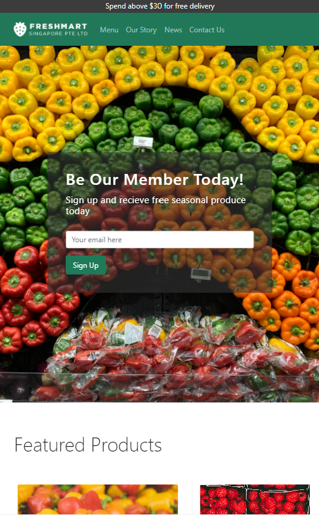

# Fresh Mart  
 

Access the live demo of the website [here](https://amazing-hamilton-02646f.netlify.app/).

## Project Summary

**Project Context**

 _Fresh Mart_ is a mobile-responsive front-end page that markets wholesale fresh produce within Singapore.

**User Goals**

The aim of users is to be able to purchase products from the website from both mobile and/or from desktop with ease.

**Organisational Goals**

The app aims to provide users with recommendations and generate income through user friendly interface.

**Justification for the App**

The main purpose of the creating this front-end landing page is to refresh the old website that is not mobile-reponsive. The original website can be found [here](http://www.fmart.com.sg/).

## Technologies Used

* HTML5
    * To create the framework of the web app
* CSS3
    * To style various elements throughout the web app
* [Bootstrap v5.0](https://getbootstrap.com/docs/5.0/getting-started/introduction/)
    * To create Carousel
    * To create Navbar
    * To create Cards
* [Git](https://git-scm.com/)
    * For version control
* [GitHub](http://github.com)
    * To create repository
* [Netlify](https://www.netlify.com/)
    * To deploy web app

## Deployment

The web app is hosted using Netlify.

    

